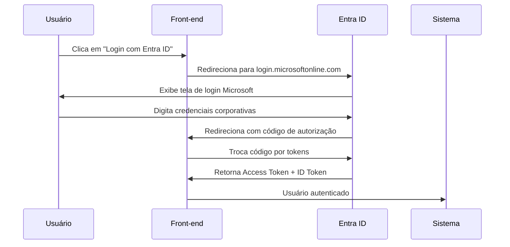

# Solicitação de Registro de Aplicação no Microsoft Entra ID

**Data:** 26/12/2025  
**Solicitante:** Equipe de Desenvolvimento - Sistema de Compartilhamento de Arquivos  
**Destinatário:** Time de Infraestrutura / Administradores Azure da Petrobras

---

## Objetivo

Registrar uma nova aplicação no Microsoft Entra ID (Azure Active Directory) da Petrobras para autenticação de usuários internos no **Sistema de Compartilhamento de Arquivos Petrobras**.

---

## Informações da Aplicação

### Nome da Aplicação
```
Sistema Compartilhamento Arquivos Petrobras
```

### Descrição
```
Sistema web para envio seguro de arquivos para destinatários externos, 
com workflow de aprovação por supervisores e auditoria completa.
```

### Tipo de Aplicação
- **Single Page Application (SPA)** - Aplicação React/Next.js

---

## Permissões Necessárias (API Permissions)

Solicitamos as seguintes permissões delegadas do Microsoft Graph:

| Permissão | Tipo | Justificativa |
|-----------|------|---------------|
| `User.Read` | Delegated | Ler perfil básico do usuário (nome, email, foto) |
| `email` | Delegated | Obter endereço de email do usuário autenticado |
| `profile` | Delegated | Obter informações de perfil (nome completo, cargo) |
| `openid` | Delegated | Autenticação OpenID Connect |

**Observação:** Não solicitamos permissões de aplicação (Application Permissions) pois não precisamos acessar dados de outros usuários, apenas do usuário logado.

---

## URLs de Redirecionamento (Redirect URIs)

### Ambiente de Desenvolvimento
```
http://localhost:3000/api/auth/callback/azure-ad
http://localhost:3000
```

### Ambiente de Produção
```
https://arquivos.petrobras.com.br/api/auth/callback/azure-ad
https://arquivos.petrobras.com.br
```

**Tipo de URI:** Web (não é Native/Mobile)

---

## Informações Necessárias para a Equipe de Desenvolvimento

Após o registro da aplicação, solicitamos que nos forneçam:

### 1. Tenant ID (ID do Inquilino)
```
UUID do tenant da Petrobras no formato:
xxxxxxxx-xxxx-xxxx-xxxx-xxxxxxxxxxxx
```
**Onde encontrar:** Azure Portal > Entra ID > Overview > Tenant ID

### 2. Client ID (Application ID)
```
UUID da aplicação criada no formato:
xxxxxxxx-xxxx-xxxx-xxxx-xxxxxxxxxxxx
```
**Onde encontrar:** Azure Portal > App Registrations > [Nome da App] > Application (client) ID

### 3. Client Secret (Chave Secreta)
```
Valor secreto gerado para a aplicação.
Sugerimos validade de 24 meses.
```
**Onde encontrar:** Azure Portal > App Registrations > [Nome da App] > Certificates & secrets > New client secret

**IMPORTANTE:** O Client Secret só é exibido UMA VEZ durante a criação. Anotar e guardar em local seguro.

---

## Configurações Adicionais Necessárias

### Token Configuration
- **ID Token:** Incluir email, profile claims
- **Access Token:** Incluir email claims

### Authentication
- **Allow public client flows:** No
- **Supported account types:** Accounts in this organizational directory only (Petrobras only - Single tenant)

### API Permissions - Admin Consent
- Solicitamos que um administrador conceda consentimento (Grant admin consent) para as permissões listadas acima

---

## Fluxo de Autenticação



---

## Benefícios da Implementação

1. **Single Sign-On (SSO)**: Usuários já logados no Windows/Office fazem login automático
2. **Segurança**: Autenticação gerenciada pela Microsoft com MFA integrado
3. **Sem Gerenciamento de Senhas**: Sistema não armazena ou valida senhas
4. **Auditoria**: Logs de autenticação centralizados no Entra ID
5. **Sincronização Automática**: Dados de usuários sincronizados com AD corporativo

---

## Prazo

Prazo desejado para fornecimento das credenciais: **3 dias úteis**

---

## Contato

**Equipe de Desenvolvimento:**
- Nome: Kleber Gonçalves
- Email: kleber.goncalves.prestserv@petrobras.com.br
- Ramal: [seu ramal]

**Supervisor Técnico:**
- Nome: Wagner Gaspar Brazil
- Email: wagner.brazil@petrobras.com.br
- Ramal: [ramal do supervisor]

---

## Anexos

- Diagrama de arquitetura do sistema
- Fluxo de autenticação detalhado
- Política de segurança da aplicação

---

**Assinatura:**

___________________________________  
Kleber Gonçalves  
Desenvolvedor Front-end  
Petrobras

Data: ___/___/______
