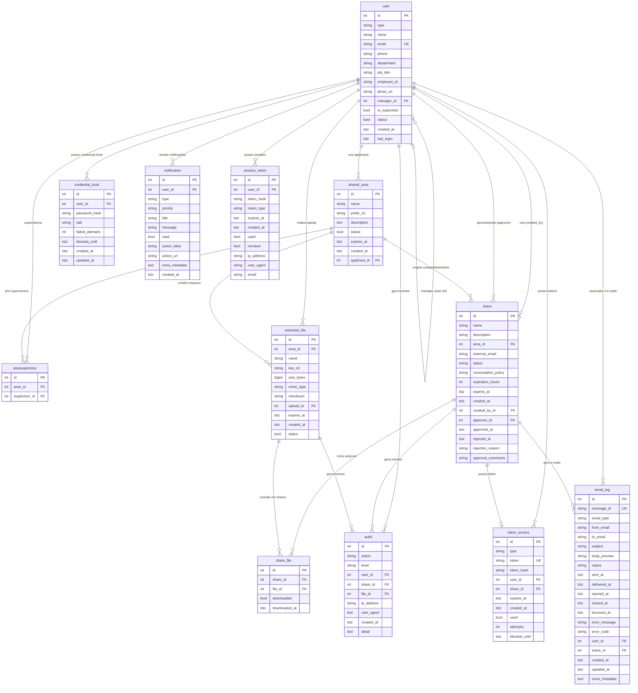

# CSA – Banco de Dados PostgreSQL: Especificação Consolidada

> **Fonte da verdade:** modelos SQLModel em `csa-backend/app/models/`  
> **Script DDL:** `csa-backend/sql/create_database.sql`  
> **Última revisão:** 2026-04-22
>
> Este documento consolida a especificação de campos (por tabela) e a documentação de relacionamentos em uma única referência.

---

## Visão Geral do Esquema

O banco possui **12 tabelas** distribuídas em três grupos funcionais:

| Grupo | Tabelas |
|---|---|
| **Identidade & Auth** | `user`, `credential_local`, `session_token` |
| **Compartilhamento** | `shared_area`, `areasupervisor`, `share`, `restricted_file`, `share_file`, `token_access` |
| **Observabilidade** | `audit`, `email_log`, `notification` |

---

## Diagrama ER (Mermaid)



---

## Especificação das Tabelas

> **Legenda da coluna "Obrigatório":**  
> - ✅ **Obrigatório** — campo `NOT NULL` no banco. A inserção falha se o valor for omitido.  
> - ❌ **Opcional** — campo `NULLABLE`. Pode ser enviado como `null` ou omitido.

### Tabela: `user`

**Descrição:** Armazena usuários do sistema. Supervisores **não** são um tipo separado — são usuários `internal` com `is_supervisor = TRUE`. A hierarquia de gestores é importada do ServiceNow via `manager_id`.

| Coluna | Tipo PostgreSQL | Obrigatório | Descrição |
|---|---|---|---|
| `id` | `SERIAL` (PK) | ✅ | Identificador único |
| `type` | `type_user` (ENUM) | ✅ | `externo` ou `internal` |
| `name` | `VARCHAR(255)` | ✅ | Nome completo |
| `email` | `VARCHAR(255)` UNIQUE | ✅ | E-mail (único no sistema) |
| `phone` | `VARCHAR(20)` | ❌ | Telefone |
| `department` | `VARCHAR(255)` | ❌ | Departamento |
| `job_title` | `VARCHAR(255)` | ❌ | Cargo |
| `employee_id` | `VARCHAR(50)` | ❌ | Matrícula funcional |
| `photo_url` | `VARCHAR(500)` | ❌ | URL da foto de perfil |
| `manager_id` | `INTEGER` (FK → `user.id`) | ❌ | Gestor imediato (auto-referência) |
| `is_supervisor` | `BOOLEAN` DEFAULT `FALSE` | ✅ | `TRUE` = pode aprovar/rejeitar shares |
| `status` | `BOOLEAN` DEFAULT `TRUE` | ✅ | Ativo/inativo |
| `created_at` | `TIMESTAMPTZ` DEFAULT `NOW()` | ✅ | Data de criação |
| `last_login` | `TIMESTAMPTZ` | ❌ | Data do último login |

**Índices:** `type`, `email`, `manager_id`

---

### Tabela: `shared_area`

**Descrição:** Define áreas de compartilhamento, cada uma mapeada a um prefixo no bucket S3. Criadas por usuários internos.

| Coluna | Tipo PostgreSQL | Obrigatório | Descrição |
|---|---|---|---|
| `id` | `SERIAL` (PK) | ✅ | Identificador único |
| `name` | `VARCHAR(255)` | ✅ | Nome da área |
| `prefix_s3` | `VARCHAR(500)` | ✅ | Prefixo do diretório no bucket S3 |
| `description` | `TEXT` | ❌ | Descrição da área |
| `status` | `BOOLEAN` DEFAULT `TRUE` | ✅ | Ativa/inativa |
| `expires_at` | `TIMESTAMPTZ` | ❌ | Prazo para encerrar/excluir a área |
| `created_at` | `TIMESTAMPTZ` DEFAULT `NOW()` | ✅ | Data de criação |
| `applicant_id` | `INTEGER` NOT NULL (FK → `user.id`) | ✅ | Usuário interno que criou a área |

**Índices:** `applicant_id` — **ON DELETE:** `RESTRICT`

---

### Tabela: `areasupervisor`

**Descrição:** Tabela pivô N:N que vincula áreas a seus supervisores. Uma área pode ter múltiplos supervisores; um supervisor pode gerenciar múltiplas áreas.

| Coluna | Tipo PostgreSQL | Obrigatório | Descrição |
|---|---|---|---|
| `id` | `SERIAL` (PK) | ✅ | Identificador único |
| `area_id` | `INTEGER` NOT NULL (FK → `shared_area.id`) | ✅ | Área supervisionada |
| `supervisor_id` | `INTEGER` NOT NULL (FK → `user.id`) | ✅ | Usuário supervisor |

**Índices:** `area_id`, `supervisor_id` — **Restrição:** `UNIQUE(area_id, supervisor_id)` — **ON DELETE:** `CASCADE`

---

### Tabela: `share`

**Descrição:** Registra compartilhamentos destinados a um e-mail externo, com controle de aprovação, política de consumo e ciclo de vida.

| Coluna | Tipo PostgreSQL | Obrigatório | Descrição |
|---|---|---|---|
| `id` | `SERIAL` (PK) | ✅ | Identificador único |
| `name` | `VARCHAR(255)` | ❌ | Título do compartilhamento |
| `description` | `VARCHAR(1000)` | ❌ | Descrição |
| `area_id` | `INTEGER` (FK → `shared_area.id`) | ❌ | Área de origem |
| `external_email` | `VARCHAR(255)` | ✅ | E-mail do destinatário externo |
| `status` | `share_status` (ENUM) | ✅ | Ver ciclo de vida abaixo |
| `consumption_policy` | `token_consumption` (ENUM) | ✅ | `apos_todos` ou `apos_primeiro` |
| `expiration_hours` | `INTEGER` DEFAULT `72` | ✅ | Validade solicitada pelo criador (horas) |
| `expires_at` | `TIMESTAMPTZ` | ❌ | Data efetiva de expiração (definida na aprovação) |
| `created_at` | `TIMESTAMPTZ` DEFAULT `NOW()` | ✅ | Data de criação |
| `created_by_id` | `INTEGER` NOT NULL (FK → `user.id`) | ✅ | Usuário interno que criou o share |
| `approver_id` | `INTEGER` (FK → `user.id`) | ❌ | Supervisor que aprovou/rejeitou |
| `approved_at` | `TIMESTAMPTZ` | ❌ | Data de aprovação |
| `rejected_at` | `TIMESTAMPTZ` | ❌ | Data de rejeição |
| `rejection_reason` | `VARCHAR(500)` | ❌ | Motivo da rejeição |
| `approval_comments` | `VARCHAR(500)` | ❌ | Comentários do aprovador |

**Índices:** `area_id`, `external_email`, `status`, `created_by_id`  
**ON DELETE:** `created_by_id` → `RESTRICT`; `area_id` e `approver_id` → `SET NULL`

**Ciclo de vida do status:**
```
pendente → aprovado → ativo → concluido
                    ↘ expirado
         → rejeitado
         → cancelado
```

**Política de consumo (`consumption_policy`):**
- `apos_todos` — token expira após **todos** os arquivos serem baixados
- `apos_primeiro` — token expira após o **primeiro** download

---

### Tabela: `restricted_file`

**Descrição:** Metadados dos arquivos restritos vinculados a uma área. O conteúdo real fica no S3; `key_s3` armazena o caminho completo do objeto (ex.: `areas/financeiro/relatorio-2024.pdf`).

| Coluna | Tipo PostgreSQL | Obrigatório | Descrição |
|---|---|---|---|
| `id` | `SERIAL` (PK) | ✅ | Identificador único |
| `area_id` | `INTEGER` NOT NULL (FK → `shared_area.id`) | ✅ | Área proprietária do arquivo |
| `name` | `VARCHAR(255)` | ✅ | Nome do arquivo |
| `key_s3` | `VARCHAR(1000)` | ✅ | Caminho completo do objeto no bucket S3 |
| `size_bytes` | `BIGINT` | ❌ | Tamanho em bytes |
| `mime_type` | `VARCHAR(127)` | ❌ | Tipo MIME (ex.: `application/pdf`) |
| `checksum` | `VARCHAR(128)` | ❌ | Hash SHA-256/SHA-512 para verificação de integridade |
| `upload_id` | `INTEGER` (FK → `user.id`) | ❌ | Usuário que realizou o upload |
| `expires_at` | `TIMESTAMPTZ` | ❌ | Data de expiração do arquivo |
| `created_at` | `TIMESTAMPTZ` DEFAULT `NOW()` | ✅ | Data de criação |
| `status` | `BOOLEAN` DEFAULT `TRUE` | ✅ | Ativo/inativo |

**Índices:** `area_id`, `upload_id` — **ON DELETE:** `area_id` → `RESTRICT`; `upload_id` → `SET NULL`

---

### Tabela: `share_file`

**Descrição:** Associação N:N entre compartilhamento e arquivo, com rastreamento de status de download individual por arquivo.

| Coluna | Tipo PostgreSQL | Obrigatório | Descrição |
|---|---|---|---|
| `id` | `SERIAL` (PK) | ✅ | Identificador único |
| `share_id` | `INTEGER` NOT NULL (FK → `share.id`) | ✅ | Compartilhamento que inclui o arquivo |
| `file_id` | `INTEGER` NOT NULL (FK → `restricted_file.id`) | ✅ | Arquivo incluído |
| `downloaded` | `BOOLEAN` DEFAULT `FALSE` | ✅ | Se o arquivo já foi baixado |
| `downloaded_at` | `TIMESTAMPTZ` | ❌ | Quando o arquivo foi baixado |

**Índices:** `share_id`, `file_id`, `downloaded` — **Restrição:** `UNIQUE(share_id, file_id)` — **ON DELETE:** `share_id` → `CASCADE`; `file_id` → `RESTRICT`

---

### Tabela: `token_access`

**Descrição:** Tokens de acesso e OTPs emitidos para destinatários externos. Possui controle de rate-limit por tentativas.

| Coluna | Tipo PostgreSQL | Obrigatório | Descrição |
|---|---|---|---|
| `id` | `SERIAL` (PK) | ✅ | Identificador único |
| `type` | `type_token` (ENUM) | ✅ | `otp` ou `access` |
| `token` | `VARCHAR(512)` UNIQUE | ❌ | Token url-safe em texto claro (somente tipo `access`) |
| `token_hash` | `VARCHAR(512)` | ❌ | Hash do código OTP de 6 dígitos (somente tipo `otp`) |
| `user_id` | `INTEGER` NOT NULL (FK → `user.id`) | ✅ | Usuário para quem o token foi emitido |
| `share_id` | `INTEGER` NOT NULL (FK → `share.id`) | ✅ | Compartilhamento ao qual o token dá acesso |
| `expires_at` | `TIMESTAMPTZ` | ✅ | Data de expiração |
| `created_at` | `TIMESTAMPTZ` DEFAULT `NOW()` | ✅ | Data de emissão |
| `used` | `BOOLEAN` DEFAULT `FALSE` | ✅ | Se o token já foi utilizado |
| `attempts` | `INTEGER` DEFAULT `0` | ✅ | Número de tentativas de verificação |
| `blocked_until` | `TIMESTAMPTZ` | ❌ | Bloqueado até esta data (rate-limit) |

**Índices:** `type`, `token`, `user_id`, `share_id`, `used`, `attempts`, `blocked_until` — **ON DELETE:** `CASCADE`

---

### Tabela: `credential_local`

**Descrição:** Credencial de senha para usuários que autenticam sem Entra ID. A senha nunca é armazenada em texto claro — aplica-se SHA-256 com salt de 32 caracteres.

| Coluna | Tipo PostgreSQL | Obrigatório | Descrição |
|---|---|---|---|
| `id` | `SERIAL` (PK) | ✅ | Identificador único |
| `user_id` | `INTEGER` NOT NULL (FK → `user.id`) | ✅ | Usuário dono da credencial |
| `password_hash` | `VARCHAR(64)` | ✅ | Hash SHA-256 da senha com salt (64 chars hex) |
| `salt` | `VARCHAR(32)` | ✅ | Salt aleatório — `secrets.token_hex(16)` = 32 chars |
| `failed_attempts` | `INTEGER` DEFAULT `0` | ✅ | Tentativas falhas consecutivas |
| `blocked_until` | `TIMESTAMPTZ` | ❌ | Bloqueado após 5 tentativas por 15 minutos |
| `created_at` | `TIMESTAMPTZ` DEFAULT `NOW()` | ✅ | Data de criação |
| `updated_at` | `TIMESTAMPTZ` | ❌ | Data da última troca de senha |

**Índices:** `user_id`, `failed_attempts`, `blocked_until` — **ON DELETE:** `CASCADE`

---

### Tabela: `email_log`

**Descrição:** Rastreamento do ciclo de vida dos e-mails enviados via AWS SES. `message_id` é o identificador retornado pelo SES, correlacionado com eventos de webhook SNS.

| Coluna | Tipo PostgreSQL | Obrigatório | Descrição |
|---|---|---|---|
| `id` | `SERIAL` (PK) | ✅ | Identificador único |
| `message_id` | `VARCHAR(255)` UNIQUE | ✅ | ID da mensagem retornado pelo SES |
| `email_type` | `email_type_enum` (ENUM) | ✅ | Finalidade do e-mail |
| `from_email` | `VARCHAR(255)` | ✅ | Remetente |
| `to_email` | `VARCHAR(255)` | ✅ | Destinatário |
| `subject` | `VARCHAR(500)` | ✅ | Assunto |
| `body_preview` | `VARCHAR(500)` | ❌ | Prévia do corpo |
| `status` | `email_status` (ENUM) | ✅ | Status atual de entrega |
| `sent_at` | `TIMESTAMPTZ` | ❌ | Data de envio |
| `delivered_at` | `TIMESTAMPTZ` | ❌ | Data de entrega confirmada |
| `opened_at` | `TIMESTAMPTZ` | ❌ | Data de abertura |
| `clicked_at` | `TIMESTAMPTZ` | ❌ | Data de clique em link |
| `bounced_at` | `TIMESTAMPTZ` | ❌ | Data de bounce |
| `error_message` | `VARCHAR(1000)` | ❌ | Mensagem de erro |
| `error_code` | `VARCHAR(50)` | ❌ | Código de erro do SES |
| `user_id` | `INTEGER` (FK → `user.id`) | ❌ | Usuário relacionado |
| `share_id` | `INTEGER` (FK → `share.id`) | ❌ | Compartilhamento que originou o e-mail |
| `created_at` | `TIMESTAMPTZ` DEFAULT `NOW()` | ✅ | Data de criação |
| `updated_at` | `TIMESTAMPTZ` | ❌ | Data da última atualização de status |
| `extra_metadata` | `TEXT` | ❌ | Metadados adicionais em JSON serializado |

**Índices:** `message_id`, `email_type`, `to_email`, `status`, `user_id`, `share_id` — **ON DELETE:** `SET NULL`

---

### Tabela: `notification`

**Descrição:** Notificações internas entregues ao painel do usuário, criadas em resposta a eventos do sistema.

| Coluna | Tipo PostgreSQL | Obrigatório | Descrição |
|---|---|---|---|
| `id` | `SERIAL` (PK) | ✅ | Identificador único |
| `user_id` | `INTEGER` NOT NULL (FK → `user.id`) | ✅ | Destinatário |
| `type` | `notification_type` (ENUM) | ✅ | Tipo da notificação |
| `priority` | `notification_priority` (ENUM) | ✅ | Prioridade de exibição |
| `title` | `VARCHAR(255)` | ✅ | Título |
| `message` | `VARCHAR(1000)` | ✅ | Mensagem |
| `read` | `BOOLEAN` DEFAULT `FALSE` | ✅ | Se foi lida pelo usuário |
| `action_label` | `VARCHAR(100)` | ❌ | Texto do botão de ação |
| `action_url` | `VARCHAR(500)` | ❌ | URL para redirecionamento no frontend |
| `extra_metadata` | `TEXT` | ❌ | Metadados adicionais em JSON serializado |
| `created_at` | `TIMESTAMPTZ` DEFAULT `NOW()` | ✅ | Data de criação |

**Índices:** `user_id`, `type`, `read` — **ON DELETE:** `CASCADE`

---

### Tabela: `session_token`

**Descrição:** Tokens de sessão persistidos que substituem o armazenamento em memória. O valor real do token **nunca** é persistido — apenas o hash.

| Coluna | Tipo PostgreSQL | Obrigatório | Descrição |
|---|---|---|---|
| `id` | `SERIAL` (PK) | ✅ | Identificador único |
| `user_id` | `INTEGER` NOT NULL (FK → `user.id`) | ✅ | Usuário dono da sessão |
| `token_hash` | `VARCHAR(512)` | ✅ | Hash do token (valor real nunca armazenado) |
| `token_type` | `session_token_type` (ENUM) | ✅ | `refresh` ou `reset` |
| `expires_at` | `TIMESTAMPTZ` | ✅ | Data de expiração |
| `created_at` | `TIMESTAMPTZ` DEFAULT `NOW()` | ✅ | Data de emissão |
| `used` | `BOOLEAN` DEFAULT `FALSE` | ✅ | Se o token já foi utilizado |
| `revoked` | `BOOLEAN` DEFAULT `FALSE` | ✅ | Se foi revogado manualmente |
| `ip_address` | `VARCHAR(45)` | ❌ | IP do cliente na emissão |
| `user_agent` | `VARCHAR(500)` | ❌ | User-Agent do cliente |
| `email` | `VARCHAR(255)` | ❌ | E-mail associado (tokens de reset podem divergir do cadastro) |

**Índices:** `user_id`, `token_hash`, `token_type` — **ON DELETE:** `CASCADE`

---

## Descrição Detalhada dos Relacionamentos

### `user` — núcleo do modelo de identidade

| Relacionamento | Cardinalidade | Descrição |
|---|---|---|
| `user.manager_id → user.id` | N:1 (auto-referência) | Hierarquia de gestores importada do ServiceNow. Um usuário pode ter um gestor (outro `user`). |
| `user → shared_area` (applicant) | 1:N | Um usuário interno pode criar várias áreas de compartilhamento. |
| `user → areasupervisor` | 1:N | Um usuário com `is_supervisor=true` pode supervisionar várias áreas. |
| `user → share` (created_by) | 1:N | Um usuário cria múltiplos compartilhamentos. |
| `user → share` (approver) | 1:N | Um supervisor pode aprovar ou rejeitar múltiplos compartilhamentos. |
| `user → restricted_file` (upload) | 1:N | Um usuário pode fazer upload de vários arquivos. |
| `user → token_access` | 1:N | Um usuário possui vários tokens emitidos (OTP e ACCESS). |
| `user → credential_local` | 1:1 | Credencial de senha local, criada apenas para auth sem Entra ID. |
| `user → session_token` | 1:N | Tokens de refresh e reset de senha persistidos. |
| `user → notification` | 1:N | Notificações internas entregues ao usuário. |
| `user → audit` | 1:N | Eventos de auditoria rastreados ao usuário (opcional, pode ser nulo). |
| `user → email_log` | 1:N | E-mails enviados associados ao usuário (opcional). |

---

### `shared_area` — área de compartilhamento

| Relacionamento | Cardinalidade | Descrição |
|---|---|---|
| `shared_area.applicant_id → user.id` | N:1 | Usuário interno responsável pela área. |
| `shared_area → areasupervisor` | 1:N | Cada área pode ter vários supervisores (tabela pivô). |
| `shared_area → restricted_file` | 1:N | Arquivos armazenados dentro da área (prefixo S3). |
| `shared_area → share` | 1:N | Compartilhamentos gerados a partir da área. |

---

### `areasupervisor` — tabela pivô N:N (área ↔ supervisor)

| Coluna | FK | Descrição |
|---|---|---|
| `area_id` | `shared_area.id` | Área supervisionada. |
| `supervisor_id` | `user.id` | Usuário supervisor da área. |

Permite que uma mesma área tenha múltiplos supervisores e que um supervisor gerencie múltiplas áreas. Restrição `UNIQUE(area_id, supervisor_id)` evita duplicatas.

---

### `share` — compartilhamento

| Relacionamento | Cardinalidade | Descrição |
|---|---|---|
| `share.area_id → shared_area.id` | N:1 | Área de origem do compartilhamento. |
| `share.created_by_id → user.id` | N:1 | Quem criou o compartilhamento. |
| `share.approver_id → user.id` | N:1 | Supervisor que aprovou ou rejeitou. |
| `share → share_file` | 1:N | Arquivos incluídos neste compartilhamento. |
| `share → token_access` | 1:1 | Token único emitido para o destinatário acessar os arquivos. |
| `share → audit` | 1:N | Eventos de auditoria relacionados ao compartilhamento. |
| `share → email_log` | 1:N | E-mails enviados em decorrência do compartilhamento. |

**Ciclo de vida do `share`:**

```
pendente → aprovado → ativo → concluido
                    ↘ expirado
         → rejeitado
         → cancelado
```

A coluna `consumption_policy` define quando o token de acesso expira:
- `apos_todos` – expira após todos os arquivos serem baixados.
- `apos_primeiro` – expira após o primeiro download.

---

### `restricted_file` — arquivo restrito

| Relacionamento | Cardinalidade | Descrição |
|---|---|---|
| `restricted_file.area_id → shared_area.id` | N:1 | Área à qual o arquivo pertence. |
| `restricted_file.upload_id → user.id` | N:1 | Usuário que realizou o upload. |
| `restricted_file → share_file` | 1:N | Um arquivo pode estar em múltiplos compartilhamentos. |
| `restricted_file → audit` | 1:N | Eventos de download, exclusão etc. |

A coluna `key_s3` armazena o caminho completo do objeto no bucket S3 (ex.: `areas/financeiro/relatorio-2024.pdf`).

---

### `share_file` — associação compartilhamento ↔ arquivo (N:N com estado)

| Coluna | FK | Descrição |
|---|---|---|
| `share_id` | `share.id` | Compartilhamento que inclui o arquivo. |
| `file_id` | `restricted_file.id` | Arquivo incluído. |

Além de mapear o N:N, registra se o arquivo já foi baixado (`downloaded`) e quando (`downloaded_at`). Restrição `UNIQUE(share_id, file_id)` evita duplicatas.

---

### `token_access` — tokens de acesso ao compartilhamento

| Relacionamento | Cardinalidade | Descrição |
|---|---|---|
| `token_access.user_id → user.id` | N:1 | Usuário (externo) para quem o token foi emitido. |
| `token_access.share_id → share.id` | N:1 (1:1 na prática) | Compartilhamento ao qual o token concede acesso. |

Dois tipos:
- **`otp`** — código de 6 dígitos enviado por e-mail; `token_hash` armazena o hash, nunca o valor em texto claro.
- **`access`** — token url-safe de longa duração; `token` armazena o valor em texto claro (apresentado uma única vez).

Controle de rate-limit: após exceder tentativas (`attempts`), o token é bloqueado até `blocked_until`.

---

### `credential_local` — credencial de senha local

| Relacionamento | Cardinalidade | Descrição |
|---|---|---|
| `credential_local.user_id → user.id` | 1:1 | Um usuário pode ter no máximo uma credencial local. |

Usada apenas quando o fluxo de autenticação via Entra ID não está disponível. A senha nunca é armazenada em texto claro: aplica-se SHA-256 com salt aleatório de 16 bytes.

---

### `session_token` — tokens de sessão (refresh / reset)

| Relacionamento | Cardinalidade | Descrição |
|---|---|---|
| `session_token.user_id → user.id` | N:1 | Usuário dono da sessão. |

Substitui armazenamento em memória. Dois tipos:
- **`refresh`** — renovação de JWT sem novo login.
- **`reset`** — token one-time para redefinição de senha.

O valor real do token nunca é persistido; apenas o `token_hash` é salvo.

---

### `audit` — log de auditoria imutável

| Relacionamento | Cardinalidade | Descrição |
|---|---|---|
| `audit.user_id → user.id` | N:1 (opcional) | Usuário responsável pela ação. |
| `audit.share_id → share.id` | N:1 (opcional) | Compartilhamento afetado. |
| `audit.file_id → restricted_file.id` | N:1 (opcional) | Arquivo envolvido na ação. |

Todas as FKs são opcionais (`ON DELETE SET NULL`) para garantir que registros de auditoria não sejam removidos quando a entidade referenciada for excluída. Ações típicas: `UPLOAD`, `EMITIR_TOKEN`, `DOWNLOAD`, `ACK`, `EXCLUIR_AREA`, `APROVAR_SHARE`, `REJEITAR_SHARE`.

---

### `email_log` — rastreamento de e-mails (AWS SES)

| Relacionamento | Cardinalidade | Descrição |
|---|---|---|
| `email_log.user_id → user.id` | N:1 (opcional) | Usuário relacionado ao e-mail. |
| `email_log.share_id → share.id` | N:1 (opcional) | Compartilhamento que originou o e-mail. |

O campo `message_id` (único) é retornado pelo SES e usado para correlacionar eventos de webhook SNS (entrega, bounce, reclamação etc.).

---

### `notification` — notificações internas

| Relacionamento | Cardinalidade | Descrição |
|---|---|---|
| `notification.user_id → user.id` | N:1 | Destinatário da notificação. |

Notificações são criadas pelo sistema em resposta a eventos (aprovação, rejeição, download, expiração). O campo `action_url` permite redirecionar o usuário ao item relacionado no frontend.

---

## Tipos Enumerados

| Tipo PostgreSQL | Tabela / Coluna | Valores |
|---|---|---|
| `type_user` | `user.type` | `externo`, `internal` |
| `type_level` | `audit.level` | `info`, `success`, `warning`, `error` |
| `share_status` | `share.status` | `pendente`, `ativo`, `aprovado`, `rejeitado`, `concluido`, `expirado`, `cancelado` |
| `token_consumption` | `share.consumption_policy` | `apos_todos`, `apos_primeiro` |
| `type_token` | `token_access.type` | `otp`, `access` |
| `session_token_type` | `session_token.token_type` | `refresh`, `reset` |
| `notification_type` | `notification.type` | `info`, `success`, `warning`, `error`, `approval`, `rejection`, `download`, `expiration` |
| `notification_priority` | `notification.priority` | `low`, `medium`, `high`, `urgent` |
| `email_status` | `email_log.status` | `pending`, `queued`, `sent`, `delivered`, `opened`, `clicked`, `bounced`, `complained`, `failed` |
| `email_type_enum` | `email_log.email_type` | `file_share`, `otp`, `approval_request`, `approval_granted`, `approval_rejected`, `expiration_warning`, `download_confirmation`, `password_reset`, `welcome`, `system` |

---

## Observações de Migração (DynamoDB → PostgreSQL)

| Aspecto | DynamoDB (anterior) | PostgreSQL (atual) |
|---|---|---|
| Chave primária | UUID / string composta | `SERIAL` (inteiro auto-incrementado) |
| Relacionamentos | Desnormalizados / embedded | FKs com integridade referencial |
| Enumerações | Strings livres | `CREATE TYPE … AS ENUM` |
| Timestamps | Epoch numérico | `TIMESTAMPTZ` (ISO-8601 com fuso) |
| JSON livre | Atributos de mapa nativo | `TEXT` com JSON serializado (`extra_metadata`) |
| Índices secundários (GSI) | Definidos na tabela DynamoDB | `CREATE INDEX` dedicado por coluna |
| Integridade | Sem suporte nativo | `ON DELETE CASCADE / SET NULL / RESTRICT` |

> O campo `extra_metadata` (presente em `notification` e `email_log`) mantém compatibilidade com dados semiestruturados que anteriormente eram atributos livres no DynamoDB.
